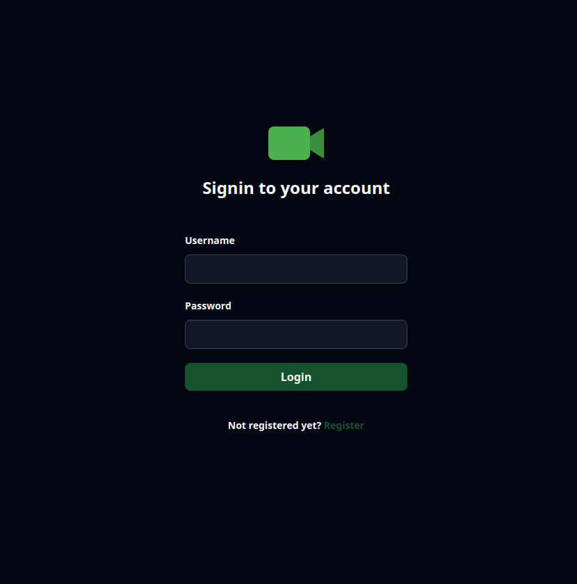
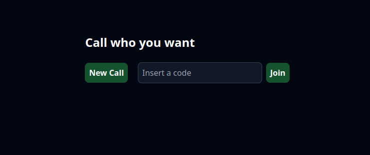
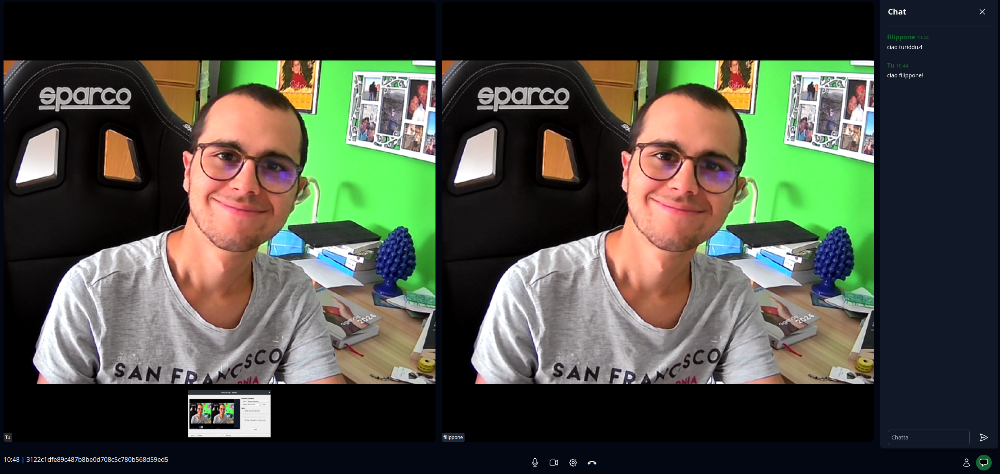

# CallTeam

**CallTeam** is a webapp that allows you to videocall teams or friends with few simple steps.

## How does it work

1.  **Signin** to your account, if already registered. Pay attention, the **username** has to be unique.
    

2.  **Create** a new call or **join** an existing one.
    

3.  **Enjoy** the call
    

## Manual Setup

Setting up is pretty straightforward. First clone the repository, and install npm packages:

```sh
git clone git@github.com:salvo-polizzi/CallTeam.git
cd CallTeam/
npm install
```

After that, edit the `.env.example` file removing the `.example` extension using your settings:

```cfg
#SERVER_PORT
PORT=<YOUR_PORT>

#SECRET SESSION KEY
SECRET_KEY=<YOUR_SECRET_KEY>

#DATABASE_URL
DATABASE_URL=<YOUR_DB_URL>
```

To start the server execute:

```sh
npm run start
```

## Authors

The project was developed by [Salvo Polizzi](https://github.com/salvo-polizzi), Computer Science students at Department of Mathematics and Computer Science, University of Catania, Italy. If you have any questions or suggestions feel free to contact us.

## Todos

-   Make user able to have his own contacts
-   Have an history of all calls the user has joined
-   Create an intermediate page before the call that let the user change/confirm his video/audio settings
-   Make a user who join the call able to change his name
-   Do a large refactor of client side javascript
